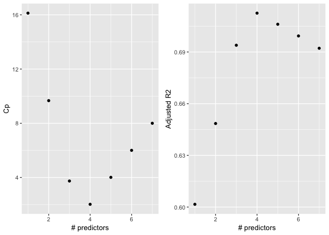
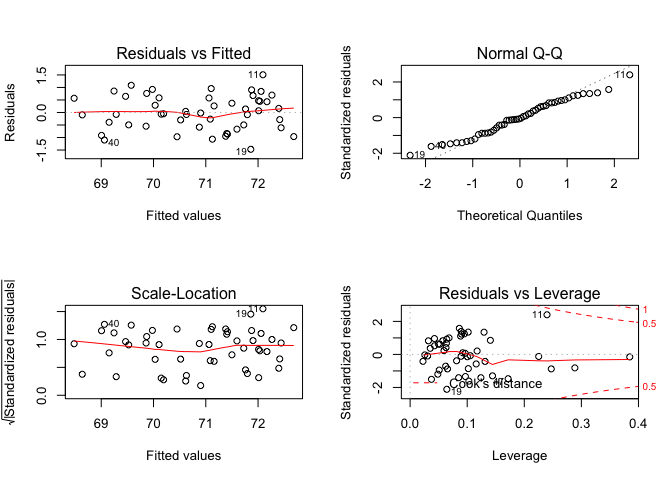
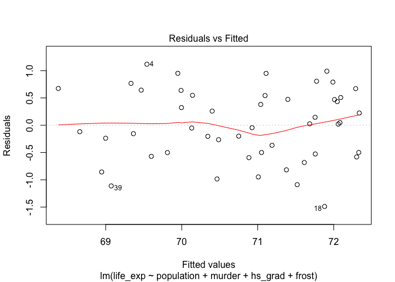
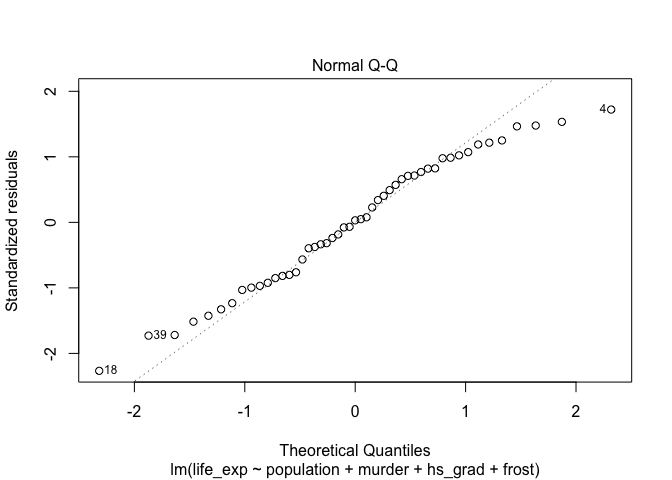
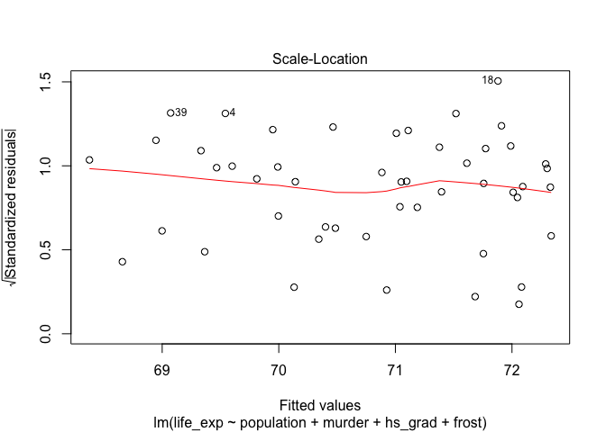
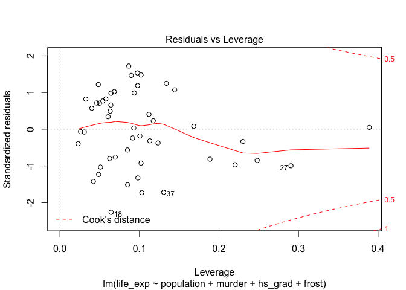
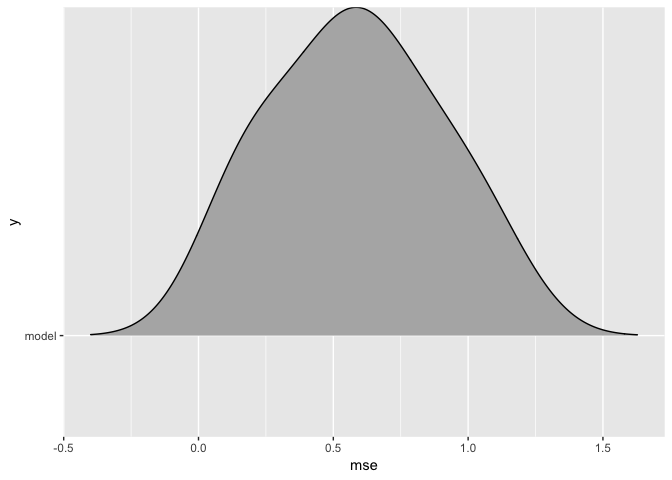
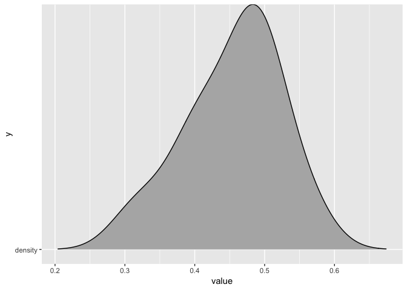
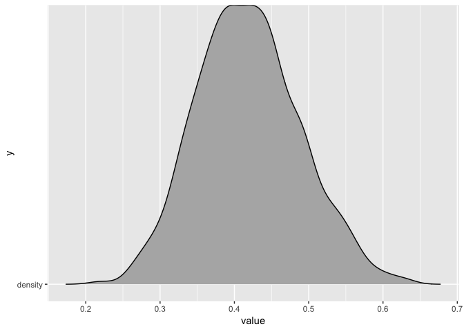

p8130\_hw5\_xy2395
================
Jack Yan
11/30/2018

Dataset Description
===================

`state.x77` is a matrix with 50 rows and 8 columns giving the following statistics in the respective columns:

-   Population: population estimate as of July 1, 1975.
-   Income: per capita income (1974).
-   Illiteracy: illiteracy (1970, percent of population).
-   Life Exp: life expectancy in years (1969–71).
-   Murder: murder and non-negligent manslaughter rate per 100,000 population (1976).
-   HS Grad: percent high-school graduates (1970).
-   Frost: mean number of days with minimum temperature below freezing (1931–1960) in capital or large city.
-   Area: land area in square miles.

``` r
# Load the data
state_df = 
  state.x77 %>% 
  as.tibble() %>% 
  janitor::clean_names() %>% 
  select(life_exp, everything())
  
# state_df %>% skimr::skim()
```

Part 1: Exploratory Data Analysis
=================================

Descriptive Statistics
----------------------

Descriptive Statistics for all the variables are shown below. All the variables are continuous.

``` r
# Build a function to generate descriptive statistics for continuous variables
summary_continuous = function(variable){
  data_frame(
    mean = mean(variable),
    sd = sd(variable),
    median = median(variable),
    maximum = max(variable),
    minimum = min(variable),
    IQR = IQR(variable)
  )
}

# Generate descriptive statistics
map(state_df, summary_continuous) %>% 
  bind_rows() %>% 
  mutate(variable = names(state_df)) %>% 
  select(variable, everything()) %>% 
  knitr::kable(digits = 2, 
               caption = "Descriptive statistics of continuous variables")
```

| variable   |      mean|        sd|    median|   maximum|  minimum|       IQR|
|:-----------|---------:|---------:|---------:|---------:|--------:|---------:|
| life\_exp  |     70.88|      1.34|     70.67|      73.6|    67.96|      1.78|
| population |   4246.42|   4464.49|   2838.50|   21198.0|   365.00|   3889.00|
| income     |   4435.80|    614.47|   4519.00|    6315.0|  3098.00|    820.75|
| illiteracy |      1.17|      0.61|      0.95|       2.8|     0.50|      0.95|
| murder     |      7.38|      3.69|      6.85|      15.1|     1.40|      6.32|
| hs\_grad   |     53.11|      8.08|     53.25|      67.3|    37.80|     11.10|
| frost      |    104.46|     51.98|    114.50|     188.0|     0.00|     73.50|
| area       |  70735.88|  85327.30|  54277.00|  566432.0|  1049.00|  44177.25|

Also show the correlation matrix to check potential correlations. `life_exp` and `murder` are highly correlated. `illiteracy` and `murder` are correlated as well.

``` r
cor(state_df) %>% 
   knitr::kable(digits = 2)
```

|            |  life\_exp|  population|  income|  illiteracy|  murder|  hs\_grad|  frost|   area|
|------------|----------:|-----------:|-------:|-----------:|-------:|---------:|------:|------:|
| life\_exp  |       1.00|       -0.07|    0.34|       -0.59|   -0.78|      0.58|   0.26|  -0.11|
| population |      -0.07|        1.00|    0.21|        0.11|    0.34|     -0.10|  -0.33|   0.02|
| income     |       0.34|        0.21|    1.00|       -0.44|   -0.23|      0.62|   0.23|   0.36|
| illiteracy |      -0.59|        0.11|   -0.44|        1.00|    0.70|     -0.66|  -0.67|   0.08|
| murder     |      -0.78|        0.34|   -0.23|        0.70|    1.00|     -0.49|  -0.54|   0.23|
| hs\_grad   |       0.58|       -0.10|    0.62|       -0.66|   -0.49|      1.00|   0.37|   0.33|
| frost      |       0.26|       -0.33|    0.23|       -0.67|   -0.54|      0.37|   1.00|   0.06|
| area       |      -0.11|        0.02|    0.36|        0.08|    0.23|      0.33|   0.06|   1.00|

Plots
-----

First, plot the highly correlated variables.

``` r
plot(state_df)
```


``` r
murder_illiteracy_points = 
state_df %>% 
  ggplot(aes(x = murder, y = illiteracy))+
    geom_point()
murder_lifeexp_points = 
state_df %>% 
  ggplot(aes(x = murder, y = life_exp))+
    geom_point()
murder_illiteracy_points + murder_lifeexp_points
```


Then check the normality of the outcome, `life_exp`. Life expectancies are approximately normally distributed among the states.

``` r
state_df %>% 
  ggplot(aes(x = life_exp)) +
  geom_histogram(bins = 15)
```


Also show the distribution of other variables.

``` r
state_df %>% select(-life_exp) %>% 
plot_num()
```


Part 2: Model Building Using Automatic Procedures
=================================================

Fit a model using all the predictors.

``` r
fit_all = lm(life_exp ~ ., data = state_df) 
summary(fit_all)
```

    ## 
    ## Call:
    ## lm(formula = life_exp ~ ., data = state_df)
    ## 
    ## Residuals:
    ##      Min       1Q   Median       3Q      Max 
    ## -1.48895 -0.51232 -0.02747  0.57002  1.49447 
    ## 
    ## Coefficients:
    ##               Estimate Std. Error t value Pr(>|t|)    
    ## (Intercept)  7.094e+01  1.748e+00  40.586  < 2e-16 ***
    ## population   5.180e-05  2.919e-05   1.775   0.0832 .  
    ## income      -2.180e-05  2.444e-04  -0.089   0.9293    
    ## illiteracy   3.382e-02  3.663e-01   0.092   0.9269    
    ## murder      -3.011e-01  4.662e-02  -6.459 8.68e-08 ***
    ## hs_grad      4.893e-02  2.332e-02   2.098   0.0420 *  
    ## frost       -5.735e-03  3.143e-03  -1.825   0.0752 .  
    ## area        -7.383e-08  1.668e-06  -0.044   0.9649    
    ## ---
    ## Signif. codes:  0 '***' 0.001 '**' 0.01 '*' 0.05 '.' 0.1 ' ' 1
    ## 
    ## Residual standard error: 0.7448 on 42 degrees of freedom
    ## Multiple R-squared:  0.7362, Adjusted R-squared:  0.6922 
    ## F-statistic: 16.74 on 7 and 42 DF,  p-value: 2.534e-10

Backward Elimination
--------------------

``` r
# no area
step1 = update(fit_all, . ~ . -area)
summary(step1)
```

    ## 
    ## Call:
    ## lm(formula = life_exp ~ population + income + illiteracy + murder + 
    ##     hs_grad + frost, data = state_df)
    ## 
    ## Residuals:
    ##      Min       1Q   Median       3Q      Max 
    ## -1.49047 -0.52533 -0.02546  0.57160  1.50374 
    ## 
    ## Coefficients:
    ##               Estimate Std. Error t value Pr(>|t|)    
    ## (Intercept)  7.099e+01  1.387e+00  51.165  < 2e-16 ***
    ## population   5.188e-05  2.879e-05   1.802   0.0785 .  
    ## income      -2.444e-05  2.343e-04  -0.104   0.9174    
    ## illiteracy   2.846e-02  3.416e-01   0.083   0.9340    
    ## murder      -3.018e-01  4.334e-02  -6.963 1.45e-08 ***
    ## hs_grad      4.847e-02  2.067e-02   2.345   0.0237 *  
    ## frost       -5.776e-03  2.970e-03  -1.945   0.0584 .  
    ## ---
    ## Signif. codes:  0 '***' 0.001 '**' 0.01 '*' 0.05 '.' 0.1 ' ' 1
    ## 
    ## Residual standard error: 0.7361 on 43 degrees of freedom
    ## Multiple R-squared:  0.7361, Adjusted R-squared:  0.6993 
    ## F-statistic: 19.99 on 6 and 43 DF,  p-value: 5.362e-11

``` r
# no illiteracy
step2 = update(step1, . ~ . -illiteracy)
summary(step2)
```

    ## 
    ## Call:
    ## lm(formula = life_exp ~ population + income + murder + hs_grad + 
    ##     frost, data = state_df)
    ## 
    ## Residuals:
    ##     Min      1Q  Median      3Q     Max 
    ## -1.4892 -0.5122 -0.0329  0.5645  1.5166 
    ## 
    ## Coefficients:
    ##               Estimate Std. Error t value Pr(>|t|)    
    ## (Intercept)  7.107e+01  1.029e+00  69.067  < 2e-16 ***
    ## population   5.115e-05  2.709e-05   1.888   0.0657 .  
    ## income      -2.477e-05  2.316e-04  -0.107   0.9153    
    ## murder      -3.000e-01  3.704e-02  -8.099 2.91e-10 ***
    ## hs_grad      4.776e-02  1.859e-02   2.569   0.0137 *  
    ## frost       -5.910e-03  2.468e-03  -2.395   0.0210 *  
    ## ---
    ## Signif. codes:  0 '***' 0.001 '**' 0.01 '*' 0.05 '.' 0.1 ' ' 1
    ## 
    ## Residual standard error: 0.7277 on 44 degrees of freedom
    ## Multiple R-squared:  0.7361, Adjusted R-squared:  0.7061 
    ## F-statistic: 24.55 on 5 and 44 DF,  p-value: 1.019e-11

``` r
# no income
step3 = update(step2, . ~ . -income)
summary(step3)
```

    ## 
    ## Call:
    ## lm(formula = life_exp ~ population + murder + hs_grad + frost, 
    ##     data = state_df)
    ## 
    ## Residuals:
    ##      Min       1Q   Median       3Q      Max 
    ## -1.47095 -0.53464 -0.03701  0.57621  1.50683 
    ## 
    ## Coefficients:
    ##               Estimate Std. Error t value Pr(>|t|)    
    ## (Intercept)  7.103e+01  9.529e-01  74.542  < 2e-16 ***
    ## population   5.014e-05  2.512e-05   1.996  0.05201 .  
    ## murder      -3.001e-01  3.661e-02  -8.199 1.77e-10 ***
    ## hs_grad      4.658e-02  1.483e-02   3.142  0.00297 ** 
    ## frost       -5.943e-03  2.421e-03  -2.455  0.01802 *  
    ## ---
    ## Signif. codes:  0 '***' 0.001 '**' 0.01 '*' 0.05 '.' 0.1 ' ' 1
    ## 
    ## Residual standard error: 0.7197 on 45 degrees of freedom
    ## Multiple R-squared:  0.736,  Adjusted R-squared:  0.7126 
    ## F-statistic: 31.37 on 4 and 45 DF,  p-value: 1.696e-12

``` r
# no pupulation
step4 = update(step3, . ~ . -population)
summary(step4)
```

    ## 
    ## Call:
    ## lm(formula = life_exp ~ murder + hs_grad + frost, data = state_df)
    ## 
    ## Residuals:
    ##     Min      1Q  Median      3Q     Max 
    ## -1.5015 -0.5391  0.1014  0.5921  1.2268 
    ## 
    ## Coefficients:
    ##              Estimate Std. Error t value Pr(>|t|)    
    ## (Intercept) 71.036379   0.983262  72.246  < 2e-16 ***
    ## murder      -0.283065   0.036731  -7.706 8.04e-10 ***
    ## hs_grad      0.049949   0.015201   3.286  0.00195 ** 
    ## frost       -0.006912   0.002447  -2.824  0.00699 ** 
    ## ---
    ## Signif. codes:  0 '***' 0.001 '**' 0.01 '*' 0.05 '.' 0.1 ' ' 1
    ## 
    ## Residual standard error: 0.7427 on 46 degrees of freedom
    ## Multiple R-squared:  0.7127, Adjusted R-squared:  0.6939 
    ## F-statistic: 38.03 on 3 and 46 DF,  p-value: 1.634e-12

The model we obtained by stepwise elimination is life\_exp ~ murder + hs\_grad + frost.

Forward Elimination
-------------------

``` r
### Step 1:  Fit simple linear regressions for all variables,look for the variable with lowest p-value
variables_list = names(state_df) 

map(variables_list, ~lm(substitute(life_exp ~ i, list(i = as.name(.x))), data = state_df)) %>% 
  map_df(., tidy) %>% 
  filter(term != "(Intercept)")
```

    ## Warning in model.matrix.default(mt, mf, contrasts): the response appeared
    ## on the right-hand side and was dropped

    ## Warning in model.matrix.default(mt, mf, contrasts): problem with term 1 in
    ## model.matrix: no columns are assigned

    ## # A tibble: 7 x 5
    ##   term          estimate  std.error statistic  p.value
    ##   <chr>            <dbl>      <dbl>     <dbl>    <dbl>
    ## 1 population -0.0000205  0.0000433     -0.473 6.39e- 1
    ## 2 income      0.000743   0.000297       2.51  1.56e- 2
    ## 3 illiteracy -1.30       0.257         -5.04  6.97e- 6
    ## 4 murder     -0.284      0.0328        -8.66  2.26e-11
    ## 5 hs_grad     0.0968     0.0195         4.96  9.20e- 6
    ## 6 frost       0.00677    0.00360        1.88  6.60e- 2
    ## 7 area       -0.00000169 0.00000226    -0.748 4.58e- 1

``` r
# Enter first the one with the lowest p-value: murder
forward1 = lm(life_exp ~ murder, data = state_df)
tidy(forward1)
```

    ## # A tibble: 2 x 5
    ##   term        estimate std.error statistic  p.value
    ##   <chr>          <dbl>     <dbl>     <dbl>    <dbl>
    ## 1 (Intercept)   73.0      0.270     270.   4.72e-78
    ## 2 murder        -0.284    0.0328     -8.66 2.26e-11

``` r
### Step 2: Enter the one with the lowest p-value in the rest 

map(.x = variables_list, ~update(forward1, substitute(. ~ . + i, list(i = as.name(.x))))) %>% 
  map_df(., tidy) %>% 
  filter(term != "(Intercept)", term != "murder")
```

    ## Warning in model.matrix.default(mt, mf, contrasts): the response appeared
    ## on the right-hand side and was dropped

    ## Warning in model.matrix.default(mt, mf, contrasts): problem with term 2 in
    ## model.matrix: no columns are assigned

    ## # A tibble: 6 x 5
    ##   term          estimate  std.error statistic p.value
    ##   <chr>            <dbl>      <dbl>     <dbl>   <dbl>
    ## 1 population  0.0000683  0.0000274      2.49  0.0164 
    ## 2 income      0.000370   0.000197       1.88  0.0666 
    ## 3 illiteracy -0.172      0.281         -0.613 0.543  
    ## 4 hs_grad     0.0439     0.0161         2.72  0.00909
    ## 5 frost      -0.00578    0.00266       -2.17  0.0352 
    ## 6 area        0.00000118 0.00000146     0.806 0.424

``` r
# Enter the one with the lowest p-value: hs_grad
forward2 <- update(forward1, . ~ . + hs_grad)
tidy(forward2)
```

    ## # A tibble: 3 x 5
    ##   term        estimate std.error statistic  p.value
    ##   <chr>          <dbl>     <dbl>     <dbl>    <dbl>
    ## 1 (Intercept)  70.3       1.02       69.2  5.91e-49
    ## 2 murder       -0.237     0.0353     -6.72 2.18e- 8
    ## 3 hs_grad       0.0439    0.0161      2.72 9.09e- 3

``` r
### Step 3: Enter the one with the lowest p-value in the rest 
map(.x = variables_list, ~update(forward2, substitute(. ~ . + i, list(i = as.name(.x))))) %>% 
  map_df(., tidy) %>% 
  filter(term != "(Intercept)", term != "murder", term != 'hs_grad')
```

    ## Warning in model.matrix.default(mt, mf, contrasts): the response appeared
    ## on the right-hand side and was dropped

    ## Warning in model.matrix.default(mt, mf, contrasts): problem with term 3 in
    ## model.matrix: no columns are assigned

    ## # A tibble: 5 x 5
    ##   term          estimate  std.error statistic p.value
    ##   <chr>            <dbl>      <dbl>     <dbl>   <dbl>
    ## 1 population  0.0000625  0.0000259      2.41  0.0199 
    ## 2 income      0.0000953  0.000239       0.398 0.692  
    ## 3 illiteracy  0.254      0.305          0.833 0.409  
    ## 4 frost      -0.00691    0.00245       -2.82  0.00699
    ## 5 area       -0.00000106 0.00000162    -0.658 0.514

``` r
# Enter the one with the lowest p-value: frost
forward3 <- update(forward2, . ~ . + frost)
tidy(forward3)
```

    ## # A tibble: 4 x 5
    ##   term         estimate std.error statistic  p.value
    ##   <chr>           <dbl>     <dbl>     <dbl>    <dbl>
    ## 1 (Intercept)  71.0       0.983       72.2  5.25e-49
    ## 2 murder       -0.283     0.0367      -7.71 8.04e-10
    ## 3 hs_grad       0.0499    0.0152       3.29 1.95e- 3
    ## 4 frost        -0.00691   0.00245     -2.82 6.99e- 3

``` r
### Step 4: Enter the one with the lowest p-value in the rest 
map(.x = variables_list, ~update(forward3, substitute(. ~ . + i, list(i = as.name(.x))))) %>% 
  map_df(., tidy) %>% 
  filter(term != "(Intercept)", term != "murder", term != 'hs_grad', term != 'frost')
```

    ## Warning in model.matrix.default(mt, mf, contrasts): the response appeared
    ## on the right-hand side and was dropped

    ## Warning in model.matrix.default(mt, mf, contrasts): problem with term 4 in
    ## model.matrix: no columns are assigned

    ## # A tibble: 4 x 5
    ##   term           estimate  std.error statistic p.value
    ##   <chr>             <dbl>      <dbl>     <dbl>   <dbl>
    ## 1 population  0.0000501   0.0000251      2.00   0.0520
    ## 2 income      0.000127    0.000223       0.571  0.571 
    ## 3 illiteracy -0.182       0.328         -0.554  0.582 
    ## 4 area       -0.000000329 0.00000154    -0.214  0.832

``` r
# P-value of all new added variables are larger than 0.05, which means that they 
# are not significant predictor, and we stop here.

# The model we obtained is life_exp ~ murder + hs_grad + frost
forward_fit = lm(life_exp ~ murder + hs_grad + frost, data = state_df)
summary(forward_fit)
```

    ## 
    ## Call:
    ## lm(formula = life_exp ~ murder + hs_grad + frost, data = state_df)
    ## 
    ## Residuals:
    ##     Min      1Q  Median      3Q     Max 
    ## -1.5015 -0.5391  0.1014  0.5921  1.2268 
    ## 
    ## Coefficients:
    ##              Estimate Std. Error t value Pr(>|t|)    
    ## (Intercept) 71.036379   0.983262  72.246  < 2e-16 ***
    ## murder      -0.283065   0.036731  -7.706 8.04e-10 ***
    ## hs_grad      0.049949   0.015201   3.286  0.00195 ** 
    ## frost       -0.006912   0.002447  -2.824  0.00699 ** 
    ## ---
    ## Signif. codes:  0 '***' 0.001 '**' 0.01 '*' 0.05 '.' 0.1 ' ' 1
    ## 
    ## Residual standard error: 0.7427 on 46 degrees of freedom
    ## Multiple R-squared:  0.7127, Adjusted R-squared:  0.6939 
    ## F-statistic: 38.03 on 3 and 46 DF,  p-value: 1.634e-12

The model we obtained by forward elimination is life\_exp ~ murder + hs\_grad + frost.

Stepwise Regreession
--------------------

``` r
step(fit_all, direction = 'backward') %>% 
  summary
```

    ## Start:  AIC=-22.18
    ## life_exp ~ population + income + illiteracy + murder + hs_grad + 
    ##     frost + area
    ## 
    ##              Df Sum of Sq    RSS     AIC
    ## - area        1    0.0011 23.298 -24.182
    ## - income      1    0.0044 23.302 -24.175
    ## - illiteracy  1    0.0047 23.302 -24.174
    ## <none>                    23.297 -22.185
    ## - population  1    1.7472 25.044 -20.569
    ## - frost       1    1.8466 25.144 -20.371
    ## - hs_grad     1    2.4413 25.738 -19.202
    ## - murder      1   23.1411 46.438  10.305
    ## 
    ## Step:  AIC=-24.18
    ## life_exp ~ population + income + illiteracy + murder + hs_grad + 
    ##     frost
    ## 
    ##              Df Sum of Sq    RSS     AIC
    ## - illiteracy  1    0.0038 23.302 -26.174
    ## - income      1    0.0059 23.304 -26.170
    ## <none>                    23.298 -24.182
    ## - population  1    1.7599 25.058 -22.541
    ## - frost       1    2.0488 25.347 -21.968
    ## - hs_grad     1    2.9804 26.279 -20.163
    ## - murder      1   26.2721 49.570  11.569
    ## 
    ## Step:  AIC=-26.17
    ## life_exp ~ population + income + murder + hs_grad + frost
    ## 
    ##              Df Sum of Sq    RSS     AIC
    ## - income      1     0.006 23.308 -28.161
    ## <none>                    23.302 -26.174
    ## - population  1     1.887 25.189 -24.280
    ## - frost       1     3.037 26.339 -22.048
    ## - hs_grad     1     3.495 26.797 -21.187
    ## - murder      1    34.739 58.041  17.456
    ## 
    ## Step:  AIC=-28.16
    ## life_exp ~ population + murder + hs_grad + frost
    ## 
    ##              Df Sum of Sq    RSS     AIC
    ## <none>                    23.308 -28.161
    ## - population  1     2.064 25.372 -25.920
    ## - frost       1     3.122 26.430 -23.877
    ## - hs_grad     1     5.112 28.420 -20.246
    ## - murder      1    34.816 58.124  15.528

    ## 
    ## Call:
    ## lm(formula = life_exp ~ population + murder + hs_grad + frost, 
    ##     data = state_df)
    ## 
    ## Residuals:
    ##      Min       1Q   Median       3Q      Max 
    ## -1.47095 -0.53464 -0.03701  0.57621  1.50683 
    ## 
    ## Coefficients:
    ##               Estimate Std. Error t value Pr(>|t|)    
    ## (Intercept)  7.103e+01  9.529e-01  74.542  < 2e-16 ***
    ## population   5.014e-05  2.512e-05   1.996  0.05201 .  
    ## murder      -3.001e-01  3.661e-02  -8.199 1.77e-10 ***
    ## hs_grad      4.658e-02  1.483e-02   3.142  0.00297 ** 
    ## frost       -5.943e-03  2.421e-03  -2.455  0.01802 *  
    ## ---
    ## Signif. codes:  0 '***' 0.001 '**' 0.01 '*' 0.05 '.' 0.1 ' ' 1
    ## 
    ## Residual standard error: 0.7197 on 45 degrees of freedom
    ## Multiple R-squared:  0.736,  Adjusted R-squared:  0.7126 
    ## F-statistic: 31.37 on 4 and 45 DF,  p-value: 1.696e-12

The model we obtained by stepwise regression is life\_exp ~ population + murder + hs\_grad + frost.

### Questions

1.  Do the procedures generate the same model?

Forward elimination and backward elimination generated the same model: `life_exp ~ murder + hs_grad + frost`. However, stepwise regression generated a larger model with one more predictor, `population`.

1.  Is there any variable a close call? What was your decision: keep or discard? Provide arguments for your choice. (Note: this question might have more or less relevance depending on the ‘subset’ you choose).

The variable `population` is a close call, with p-value = 0.052 ∼0.05. I would keep it, because its p-value is quite close to 0.05. This model has a better AIC than a smaller model. Also, adding 'population' contributes to the goodness of fit by increasing the adjusted R2 from 0.6939 to 0.7126.

1.  Is there any association between ‘Illiteracy’ and ‘HS graduation rate’? Does your ‘subset’ contain both?

The Pearson correlation coefficient between ‘Illiteracy’ and ‘HS graduation rate’ is -0.66, indicating a moderate association. My subset only contains one of them. ‘Illiteracy’ is not included.

Part 3: Criterion-based Procedures
==================================

``` r
# Leaps function provides all-subsets analysis

# Printing the 2 best models of each size, using the Cp criterion:
leaps(x = state_df %>% select(-life_exp), y = state_df[[1]], nbest = 1, method = "Cp")
```

    ## $which
    ##       1     2     3    4     5     6     7
    ## 1 FALSE FALSE FALSE TRUE FALSE FALSE FALSE
    ## 2 FALSE FALSE FALSE TRUE  TRUE FALSE FALSE
    ## 3 FALSE FALSE FALSE TRUE  TRUE  TRUE FALSE
    ## 4  TRUE FALSE FALSE TRUE  TRUE  TRUE FALSE
    ## 5  TRUE  TRUE FALSE TRUE  TRUE  TRUE FALSE
    ## 6  TRUE  TRUE  TRUE TRUE  TRUE  TRUE FALSE
    ## 7  TRUE  TRUE  TRUE TRUE  TRUE  TRUE  TRUE
    ## 
    ## $label
    ## [1] "(Intercept)" "1"           "2"           "3"           "4"          
    ## [6] "5"           "6"           "7"          
    ## 
    ## $size
    ## [1] 2 3 4 5 6 7 8
    ## 
    ## $Cp
    ## [1] 16.126760  9.669894  3.739878  2.019659  4.008737  6.001959  8.000000

``` r
# Printing the 2 best models of each size, using the adjusted R^2 criterion:
leaps(x = state_df %>% select(-life_exp), y = state_df[[1]], nbest = 1, method = "adjr2")
```

    ## $which
    ##       1     2     3    4     5     6     7
    ## 1 FALSE FALSE FALSE TRUE FALSE FALSE FALSE
    ## 2 FALSE FALSE FALSE TRUE  TRUE FALSE FALSE
    ## 3 FALSE FALSE FALSE TRUE  TRUE  TRUE FALSE
    ## 4  TRUE FALSE FALSE TRUE  TRUE  TRUE FALSE
    ## 5  TRUE  TRUE FALSE TRUE  TRUE  TRUE FALSE
    ## 6  TRUE  TRUE  TRUE TRUE  TRUE  TRUE FALSE
    ## 7  TRUE  TRUE  TRUE TRUE  TRUE  TRUE  TRUE
    ## 
    ## $label
    ## [1] "(Intercept)" "1"           "2"           "3"           "4"          
    ## [6] "5"           "6"           "7"          
    ## 
    ## $size
    ## [1] 2 3 4 5 6 7 8
    ## 
    ## $adjr2
    ## [1] 0.6015893 0.6484991 0.6939230 0.7125690 0.7061129 0.6993268 0.6921823

``` r
# Summary of models for each size (one model per size)
b = regsubsets(life_exp ~ ., data = state_df)
rs <- summary(b) 

# Plots of Cp and Adj-R2 as functions of parameters
plot_cp = 
  tibble(x = 1:7, y = rs$cp) %>% 
  ggplot(aes(x = x, y = y)) +
    geom_point() +
    labs(x = "# predictors", y = "Cp")
plot_adjr2 = 
  tibble(x = 1:7, y = rs$adjr2) %>% 
  ggplot(aes(x = x, y = y)) +
    geom_point() +
    labs(x = "# predictors", y = "Adjusted R2")

plot_cp + plot_adjr2
```



``` r
rs
```

    ## Subset selection object
    ## Call: regsubsets.formula(life_exp ~ ., data = state_df)
    ## 7 Variables  (and intercept)
    ##            Forced in Forced out
    ## population     FALSE      FALSE
    ## income         FALSE      FALSE
    ## illiteracy     FALSE      FALSE
    ## murder         FALSE      FALSE
    ## hs_grad        FALSE      FALSE
    ## frost          FALSE      FALSE
    ## area           FALSE      FALSE
    ## 1 subsets of each size up to 7
    ## Selection Algorithm: exhaustive
    ##          population income illiteracy murder hs_grad frost area
    ## 1  ( 1 ) " "        " "    " "        "*"    " "     " "   " " 
    ## 2  ( 1 ) " "        " "    " "        "*"    "*"     " "   " " 
    ## 3  ( 1 ) " "        " "    " "        "*"    "*"     "*"   " " 
    ## 4  ( 1 ) "*"        " "    " "        "*"    "*"     "*"   " " 
    ## 5  ( 1 ) "*"        "*"    " "        "*"    "*"     "*"   " " 
    ## 6  ( 1 ) "*"        "*"    "*"        "*"    "*"     "*"   " " 
    ## 7  ( 1 ) "*"        "*"    "*"        "*"    "*"     "*"   "*"

Based on the Cp and adjusted R2 criterion, I would choose the 4-predictor model. The best 4-predictor model is life\_exp ~ population + murder + hs\_grad + frost. It has the highest adjusted R2 and the lowest Cp value.

Part 4: Diagnostics
===================

The models chosen from Part 2 and 3 are the same: life\_exp ~ population + murder + hs\_grad + frost, so we will use this one as our final model.

``` r
final_fit = lm(life_exp ~ population + murder + hs_grad + frost, data = state_df)
par(mfrow = c(2,2))
plot(final_fit)
```



``` r
influence.measures(final_fit)
```

    ## Influence measures of
    ##   lm(formula = life_exp ~ population + murder + hs_grad + frost,      data = state_df) :
    ## 
    ##       dfb.1_  dfb.pplt  dfb.mrdr  dfb.hs_g  dfb.frst    dffit cov.r
    ## 1   0.035492 -1.31e-01  1.81e-01 -0.040552 -0.093627  0.34385 1.200
    ## 2   0.410334  1.83e-01 -4.02e-01 -0.349223 -0.164049 -0.50117 1.364
    ## 3   0.015219  2.09e-01  5.00e-02 -0.236749  0.457644 -0.53734 1.081
    ## 4   0.329890 -1.72e-01  2.46e-03 -0.317837 -0.087569  0.49350 0.921
    ## 5   0.035541 -9.14e-02  4.05e-03 -0.044178  0.026988 -0.11867 1.814
    ## 6  -0.316742 -5.38e-02  2.18e-01  0.272452  0.219005  0.44171 0.986
    ## 7   0.051252  1.77e-02 -9.17e-02 -0.024669  0.010955  0.14381 1.125
    ## 8  -0.047471  1.85e-01  3.13e-02 -0.036008  0.090584 -0.30196 0.896
    ## 9  -0.000547  2.67e-03  9.55e-04  0.006028 -0.014997  0.02107 1.238
    ## 10 -0.008460  8.05e-03 -2.53e-02  0.016126 -0.003117 -0.04691 1.241
    ## 11 -0.033009 -5.69e-01 -2.76e-01  0.664444 -1.244026  1.42824 0.741
    ## 12 -0.025510 -5.09e-02  7.21e-05  0.049597 -0.006575  0.11025 1.134
    ## 13  0.007812 -1.81e-02 -9.37e-03 -0.000558 -0.014652 -0.02615 1.250
    ## 14 -0.000389 -1.61e-03  7.15e-05  0.000713 -0.001883 -0.00488 1.148
    ## 15  0.012296  5.30e-03 -3.71e-02  0.002013 -0.001564  0.05819 1.182
    ## 16 -0.017022 -4.31e-02 -6.33e-02  0.084668 -0.057912  0.20256 1.054
    ## 17  0.235268 -5.35e-02  5.72e-02 -0.303436  0.095100  0.40778 1.036
    ## 18 -0.057605  7.39e-02 -5.88e-02  0.036101  0.101646 -0.20714 1.219
    ## 19 -0.221919  4.84e-02  2.91e-01  0.174087 -0.166830 -0.57681 0.709
    ## 20  0.002387  7.62e-03 -1.99e-02 -0.003218 -0.004869 -0.06309 1.122
    ## 21 -0.052828 -8.12e-02  1.63e-01 -0.023468  0.081194 -0.23178 1.098
    ## 22 -0.146492  1.63e-01  2.01e-01  0.041939  0.203775  0.34590 1.069
    ## 23  0.061153  7.86e-02 -1.55e-01 -0.036661  0.075346  0.27039 1.073
    ## 24 -0.152293  1.93e-01 -1.58e-01  0.159679  0.083500 -0.44227 1.011
    ## 25  0.020092  6.51e-03  5.33e-02 -0.046052  0.055511  0.14957 1.071
    ## 26  0.071108  9.14e-02 -2.42e-02 -0.080966 -0.098656 -0.27162 1.000
    ## 27  0.016596 -2.02e-02 -7.07e-02  0.020076 -0.005414  0.14244 1.132
    ## 28  0.402992  1.43e-01 -4.24e-01 -0.288096 -0.283276 -0.51725 1.460
    ## 29 -0.009464  2.56e-02  4.10e-02  0.008083 -0.085716 -0.18242 1.127
    ## 30 -0.088716 -1.38e-01  1.24e-01  0.071170 -0.017018 -0.21995 1.065
    ## 31 -0.049072 -5.53e-02  7.62e-02  0.039222  0.028848  0.10637 1.171
    ## 32  0.011393 -6.01e-02 -4.89e-03 -0.002487 -0.012640 -0.06681 1.442
    ## 33 -0.019970 -1.75e-03 -3.80e-03  0.025276 -0.005219 -0.03437 1.227
    ## 34  0.291080  9.70e-03 -2.82e-01 -0.297496  0.209852  0.52382 1.047
    ## 35  0.002238 -9.51e-02  1.05e-02  0.013510 -0.044242 -0.11347 1.198
    ## 36  0.035812 -1.99e-02 -2.89e-02 -0.011934 -0.037269  0.07001 1.142
    ## 37 -0.023790  3.95e-02  7.55e-02 -0.054191  0.135471 -0.16331 1.262
    ## 38 -0.139407 -4.61e-01  1.88e-01  0.193251 -0.169119 -0.53682 1.019
    ## 39  0.062823 -5.58e-03 -5.47e-02 -0.051111 -0.004418  0.07465 1.262
    ## 40 -0.317583  1.58e-01 -9.62e-02  0.357681  0.020151 -0.55733 0.925
    ## 41  0.015278 -1.23e-03 -1.79e-02 -0.013387  0.009648  0.03141 1.231
    ## 42  0.120516 -4.05e-02  4.94e-02 -0.136805 -0.009497  0.24190 1.086
    ## 43  0.018620  2.71e-01  6.79e-02 -0.025291 -0.096144  0.45875 1.013
    ## 44 -0.222055 -1.08e-01  4.13e-02  0.298455 -0.017639  0.38846 1.037
    ## 45 -0.040916 -6.45e-02  4.00e-02  0.022311  0.117523  0.20328 1.099
    ## 46 -0.005268  2.62e-05 -3.35e-03  0.005718  0.000217 -0.01658 1.153
    ## 47  0.006164  9.92e-02  2.62e-01 -0.320275  0.559123 -0.67816 1.056
    ## 48 -0.374426  7.95e-02  1.66e-01  0.354831  0.010543 -0.43422 0.976
    ## 49  0.069886  6.29e-02 -1.10e-01 -0.057052  0.044388  0.17475 1.136
    ## 50  0.186254  9.61e-02 -1.55e-01 -0.154629 -0.146677 -0.28910 1.147
    ##      cook.d    hat inf
    ## 1  2.38e-02 0.1406    
    ## 2  5.05e-02 0.2473   *
    ## 3  5.68e-02 0.1443    
    ## 4  4.71e-02 0.0862    
    ## 5  2.88e-03 0.3848   *
    ## 6  3.82e-02 0.0896    
    ## 7  4.19e-03 0.0494    
    ## 8  1.77e-02 0.0374    
    ## 9  9.08e-05 0.0965    
    ## 10 4.50e-04 0.1003    
    ## 11 3.64e-01 0.2398   *
    ## 12 2.47e-03 0.0428    
    ## 13 1.40e-04 0.1054    
    ## 14 4.88e-06 0.0257    
    ## 15 6.92e-04 0.0593    
    ## 16 8.22e-03 0.0426    
    ## 17 3.28e-02 0.0951    
    ## 18 8.71e-03 0.1157    
    ## 19 6.13e-02 0.0642    
    ## 20 8.11e-04 0.0225    
    ## 21 1.08e-02 0.0654    
    ## 22 2.38e-02 0.0884    
    ## 23 1.46e-02 0.0682    
    ## 24 3.84e-02 0.0969    
    ## 25 4.51e-03 0.0321    
    ## 26 1.46e-02 0.0485    
    ## 27 4.12e-03 0.0519    
    ## 28 5.39e-02 0.2886   *
    ## 29 6.73e-03 0.0622    
    ## 30 9.70e-03 0.0510    
    ## 31 2.31e-03 0.0629    
    ## 32 9.13e-04 0.2252   *
    ## 33 2.42e-04 0.0893    
    ## 34 5.39e-02 0.1295    
    ## 35 2.62e-03 0.0814    
    ## 36 1.00e-03 0.0353    
    ## 37 5.43e-03 0.1313    
    ## 38 5.63e-02 0.1240    
    ## 39 1.14e-03 0.1174    
    ## 40 5.99e-02 0.1029    
    ## 41 2.02e-04 0.0921    
    ## 42 1.17e-02 0.0642    
    ## 43 4.13e-02 0.1017    
    ## 44 2.98e-02 0.0901    
    ## 45 8.32e-03 0.0572    
    ## 46 5.62e-05 0.0305    
    ## 47 8.96e-02 0.1717    
    ## 48 3.69e-02 0.0850    
    ## 49 6.18e-03 0.0636    
    ## 50 1.68e-02 0.1020

1.  Identify any leverage and/or influential points and take appropriate measures.

Based on Cook's distance, Observation 11 is a potentially influential observation. Remove this point and fit the model again.

``` r
state_df_no_11 = 
  state_df %>% 
  mutate(index = 1:nrow(state_df)) %>% 
  filter(!index %in% c(11)) 

final_fit_no_11 = lm(life_exp ~ population + murder + hs_grad + frost, data = state_df_no_11)
plot(final_fit_no_11)
```



1.  Check the model assumptions.

The residuals are spread equally along the fitted values. We can assume that the residuals have mean 0 and equal variance, and are independent of each other. The QQ plot shows a minor deviate from normal distribubtion at the tail, which may be caused by outliers.

Model Validation
================

Using the ‘final’ model chosen in part 4, focus on MSE to test the model predictive ability.

1.  Use a 10-fold cross-validation (10 repeats).

``` r
cv_df = 
  crossv_kfold(state_df, 10) %>% 
  mutate(model = map(train, ~lm(life_exp ~ population + murder + hs_grad + frost, data = .x))) %>% 
  mutate(mse = map2_dbl(model, test, ~mse(model = .x, data = .y))) 

cv_df$mse
```

    ##         1         2         3         4         5         6         7 
    ## 0.9307902 0.4690411 0.8255672 0.5895689 0.3437787 0.1233849 0.6700353 
    ##         8         9        10 
    ## 1.1044207 0.1937369 0.5880460

``` r
summary_continuous(cv_df$mse)
```

    ## # A tibble: 1 x 6
    ##    mean    sd median maximum minimum   IQR
    ##   <dbl> <dbl>  <dbl>   <dbl>   <dbl> <dbl>
    ## 1 0.584 0.315  0.589    1.10   0.123 0.412

``` r
cv_df %>% 
  ggplot(aes(x = mse, y = "model")) +
  geom_density_ridges()
```

    ## Picking joint bandwidth of 0.174



1.  Bootstrapping

``` r
set.seed(1)
fit_final = lm(life_exp ~ population + murder + hs_grad + frost, data = state_df)

bootstrap_df = 
  state_df %>% 
  add_predictions(fit_final) %>% 
  mutate(resid = life_exp - pred) 

bootstrap = function(x){
  bootstrap_df_new =
    bootstrap_df %>% 
    mutate(y_new = pred + sample(bootstrap_df$resid, replace = TRUE)) 
  model = lm(y_new ~ population + murder + hs_grad + frost, data = bootstrap_df_new)
  mse(model, bootstrap_df_new)
}

result_df_10 = 
  map(1:10, bootstrap) %>% 
  c() %>%  as.numeric %>% as.tibble()

result_df_1000 = 
  map(1:1000, bootstrap) %>% 
  c() %>%  as.numeric %>% as.tibble()

summary_continuous(result_df_10$value)
```

    ## # A tibble: 1 x 6
    ##    mean     sd median maximum minimum    IQR
    ##   <dbl>  <dbl>  <dbl>   <dbl>   <dbl>  <dbl>
    ## 1 0.455 0.0688  0.475   0.558   0.320 0.0913

``` r
summary_continuous(result_df_1000$value)
```

    ## # A tibble: 1 x 6
    ##    mean     sd median maximum minimum    IQR
    ##   <dbl>  <dbl>  <dbl>   <dbl>   <dbl>  <dbl>
    ## 1 0.419 0.0690  0.417   0.631   0.219 0.0907

``` r
result_df_10 %>% 
  ggplot(aes(y="density", x = value)) +
    geom_density_ridges()
```

    ## Picking joint bandwidth of 0.0387



``` r
result_df_1000 %>% 
  ggplot(aes(y="density", x = value)) +
    geom_density_ridges()
```

    ## Picking joint bandwidth of 0.0153



1.  Summary

``` r
bind_rows(
  summary_continuous(cv_df$mse),
  summary_continuous(result_df_10$value),
  summary_continuous(result_df_1000$value)
) %>% 
  mutate(method = c('CV-10fold', 'bootstrap-10X','bootstrap-1000X')) %>% 
  select(method, everything()) %>% 
  knitr::kable(digits = 2)
```

| method          |  mean|    sd|  median|  maximum|  minimum|   IQR|
|:----------------|-----:|-----:|-------:|--------:|--------:|-----:|
| CV-10fold       |  0.58|  0.31|    0.59|     1.10|     0.12|  0.41|
| bootstrap-10X   |  0.46|  0.07|    0.47|     0.56|     0.32|  0.09|
| bootstrap-1000X |  0.42|  0.07|    0.42|     0.63|     0.22|  0.09|

Although the medians of the two methods are similar (0.41 vs 0.42), their means and standard deviations are quite different. For bootstrapping, The means and SD's of MSE are similar in the 10 trials and 1000 trials, showing reliability of this method even with small amount of trials. On the other hand, the standard deviation for the Cross Validation method is significantly higher, which indicates a low stability of this method, especially when k (\# of folds) is small. Therefore, I would recommend *bootstrapping* for assessing model performance.
