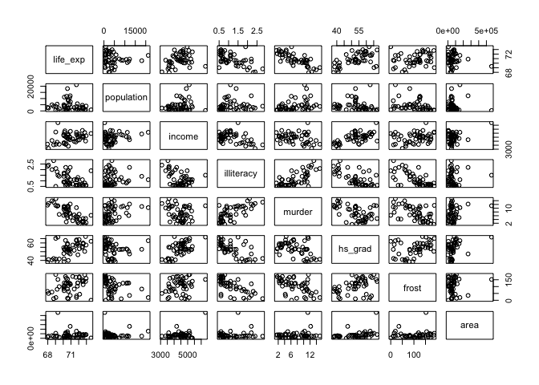
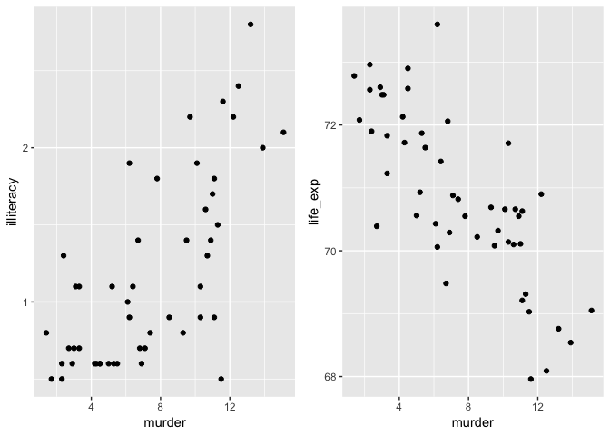
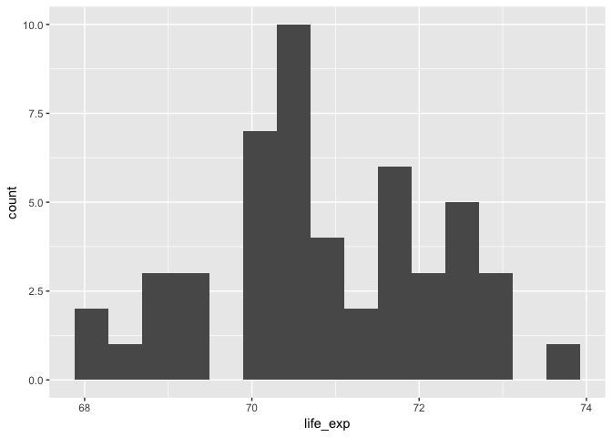

p8130\_hw5\_xy2395
================
Jack Yan
11/30/2018

Dataset Description
===================

`state.x77` is a matrix with 50 rows and 8 columns giving the following statistics in the respective columns:

-   Population: population estimate as of July 1, 1975.
-   Income: per capita income (1974).
-   Illiteracy: illiteracy (1970, percent of population).
-   Life Exp: life expectancy in years (1969–71).
-   Murder: murder and non-negligent manslaughter rate per 100,000 population (1976).
-   HS Grad: percent high-school graduates (1970).
-   Frost: mean number of days with minimum temperature below freezing (1931–1960) in capital or large city.
-   Area: land area in square miles.

``` r
# Load the data
state_df = 
  state.x77 %>% 
  as.tibble() %>% 
  janitor::clean_names() %>% 
  select(life_exp, everything())
  
# state_df %>% skimr::skim()
```

Problem 1: Exploratory Data Analysis
====================================

Descriptive Statistics
----------------------

Descriptive Statistics for all the variables are shown below. All the variables are continuous.

``` r
# Build a function to generate descriptive statistics for continuous variables
summary_continuous = function(variable){
  data_frame(
    mean = mean(variable),
    sd = sd(variable),
    median = median(variable),
    maximum = max(variable),
    minimum = min(variable),
    IQR = IQR(variable)
  )
}

# Generate descriptive statistics
map(state_df, summary_continuous) %>% 
  bind_rows() %>% 
  mutate(variable = names(state_df)) %>% 
  select(variable, everything()) %>% 
  knitr::kable(digits = 2, 
               caption = "Descriptive statistics of continuous variables")
```

| variable   |      mean|        sd|    median|   maximum|  minimum|       IQR|
|:-----------|---------:|---------:|---------:|---------:|--------:|---------:|
| life\_exp  |     70.88|      1.34|     70.67|      73.6|    67.96|      1.78|
| population |   4246.42|   4464.49|   2838.50|   21198.0|   365.00|   3889.00|
| income     |   4435.80|    614.47|   4519.00|    6315.0|  3098.00|    820.75|
| illiteracy |      1.17|      0.61|      0.95|       2.8|     0.50|      0.95|
| murder     |      7.38|      3.69|      6.85|      15.1|     1.40|      6.32|
| hs\_grad   |     53.11|      8.08|     53.25|      67.3|    37.80|     11.10|
| frost      |    104.46|     51.98|    114.50|     188.0|     0.00|     73.50|
| area       |  70735.88|  85327.30|  54277.00|  566432.0|  1049.00|  44177.25|

Also show the correlation matrix to check potential correlations. `life_exp` and `murder` are highly correlated. `illiteracy` and `murder` are correlated as well.

``` r
cor(state_df) %>% 
   knitr::kable(digits = 2)
```

|            |  life\_exp|  population|  income|  illiteracy|  murder|  hs\_grad|  frost|   area|
|------------|----------:|-----------:|-------:|-----------:|-------:|---------:|------:|------:|
| life\_exp  |       1.00|       -0.07|    0.34|       -0.59|   -0.78|      0.58|   0.26|  -0.11|
| population |      -0.07|        1.00|    0.21|        0.11|    0.34|     -0.10|  -0.33|   0.02|
| income     |       0.34|        0.21|    1.00|       -0.44|   -0.23|      0.62|   0.23|   0.36|
| illiteracy |      -0.59|        0.11|   -0.44|        1.00|    0.70|     -0.66|  -0.67|   0.08|
| murder     |      -0.78|        0.34|   -0.23|        0.70|    1.00|     -0.49|  -0.54|   0.23|
| hs\_grad   |       0.58|       -0.10|    0.62|       -0.66|   -0.49|      1.00|   0.37|   0.33|
| frost      |       0.26|       -0.33|    0.23|       -0.67|   -0.54|      0.37|   1.00|   0.06|
| area       |      -0.11|        0.02|    0.36|        0.08|    0.23|      0.33|   0.06|   1.00|

Plots
-----

First, plot the highly correlated variables.

``` r
plot(state_df)
```



``` r
murder_illiteracy_points = 
state_df %>% 
  ggplot(aes(x = murder, y = illiteracy))+
    geom_point()
murder_lifeexp_points = 
state_df %>% 
  ggplot(aes(x = murder, y = life_exp))+
    geom_point()
murder_illiteracy_points + murder_lifeexp_points
```



Then check the normality of the outcome, `life_exp`. Life expectancies are approximately normally distributed among the states.

``` r
state_df %>% 
  ggplot(aes(x = life_exp)) +
  geom_histogram(bins = 15)
```



Also show the distribution of other variables.

``` r
state_df %>% select(-life_exp) %>% 
plot_num()
```


Problem 2: Model Building Using Automatic Procedures
====================================================
